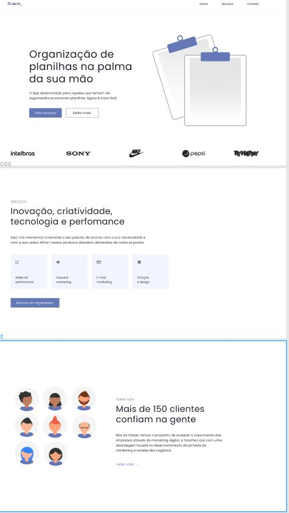

<h1 align='center'>Desafio Road to Dev Jr - Planilhas e mais planilhas</h1>

<h3>🔖Saudação</h3>

Fala dev beleza ?Bom, aqui iniciamos nossa jornada ao segundo estágio em rumo ao posto de Dev Jr ,espero que você embarque nessa ideia juntamenteconosco e vamos melhorando a cada dia! Bora codar!

<h3>🔖O Briefing..</h3>

'' Bom dia, recentemente criamos um App que auxiliana criação de planilhas, porém sentimos que ainda está faltando algo para nos ajudar na divulgação do produto, estamos precisando de uma página, única mesmo, gostamos do padrão clean e minimalista, sem exageros ou cores extravagantes. Nossa equipe desenvolveu o layout e precisamos que você o programe para nós".

<h3>🚀 Tecnologias</h3>
<ul>
    <li><a href="" target="_blank">Html</a></li>
    <li><a href="" target="_blank">Css</a></li>
     <li><a href="" target="_blank">JS (Opcional)</a></li>
</ul>

<h3>🖼 Layout</h3>

